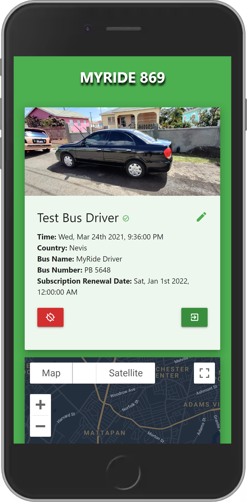

<link href="style.css" rel="stylesheet">

# MyRide
Visit <a href="http://myride869.web.app/" target="_blank" />MyRide869</a>.
**Only available on mobile devices**
All in one transportation web app tailored to the island of St. Kitts and Nevis.

MyRide has four (4) sides which are:
* Customer
  * View and request rentals
  * View public buses information ( bus photo, license plate number, location, time of update, direction heading, time away from user )
  * Send a public hail to buses so that bus drivers can see where potential passengers are.
  * Can view buses on map to see exact location
  * Upload feedback
  * Request private ride from "Uber" driver
* Admin 
  * Can see all user profile
  * Edit necessary information and add images for drivers
  * Edit rentals and the dealers for the rentals
  * See rental history
  * See uploaded user feedback
  * See information from bus simulation
* Bus Drivers 
  * See location of public hails
  * Once active status update location and information for app users
* Uber Driver
  * Once active status wait for ride request from user to go for ride

## Technology included:
* React JS
* Google Firebase(Authentication, Realtime database, Firestore databse, Cloud functions and Hosting)
* Google Analytics
* Google Maps API
* Materialize CSS front-end framework
* Redux
* Paypal payment integration

# Customer View

  

    <h3>Login Screen</h3>
    
  

  
  

    <h3>Public Buses Info Screen</h3>
    
  

  
  

    <h3>Rentals Screen</h3>
    
  

  
  

    <h3>Ride hail Screen</h3>
    
  

# Admin View

  

    <h3>Admin dashboard</h3>
    
  

  
  

    <h3>User management</h3>
    
  

  
  

    <h3>Bus simulation (developer purposes)</h3>
    
  

  
  

    <h3>Rentals management</h3>
    
  

  
  

    <h3>User feedback</h3>
    
  

# Bus Driver View

  

    <h3>Bus Driver dashboard</h3>
    
  

  
   

    <h3>Driver info</h3>
    
  

# Uber Driver View

  

    <h3>Uber driver dashboard</h3>
    
  

  
   

    <h3>Ride request</h3>
    
  

  

    <h3>Accepted ride request</h3>
    
  

