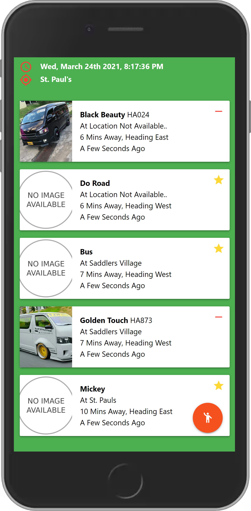
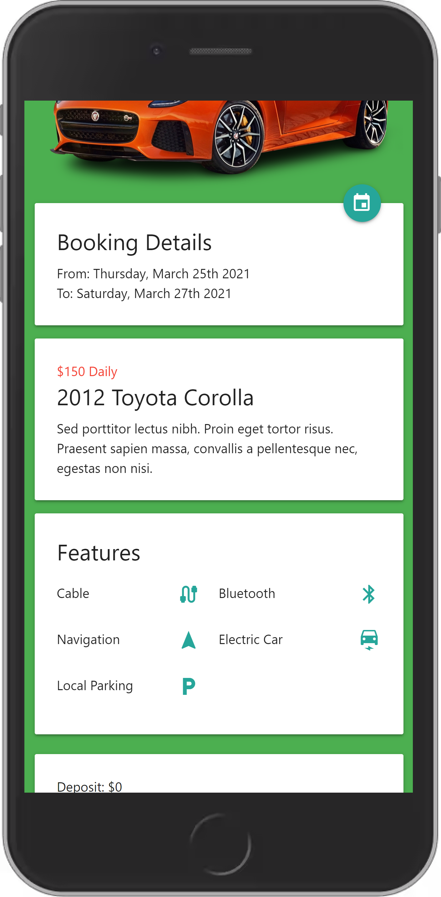
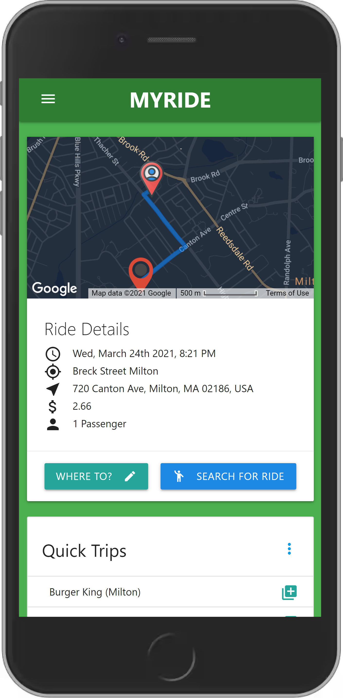

# MyRide
<style

Visit <a href="http://myride869.web.app/" target="_blank" />MyRide869</a>.
All in one transportation web app tailored to the island of St. Kitts and Nevis.
MyRide has four (4) sides which are Admin, Bus Drivers, Uber Driver and Customer.
Technology included:

- React JS
- Google Firebase(Authentication, Realtime database, Firestore databse, Cloud functions and Hosting)
- Google Analytics
- Google Maps API
- Materialize CSS front-end framework
- Redux
- Paypal payment integration

  

    ## Login Screen
    
  

  
  

    ## Public Buses Info Screen
    
  

  
  

    ## Rentals Screen
    
  

  
  

    <h3>Ride hail Screen</h3>
    
  

